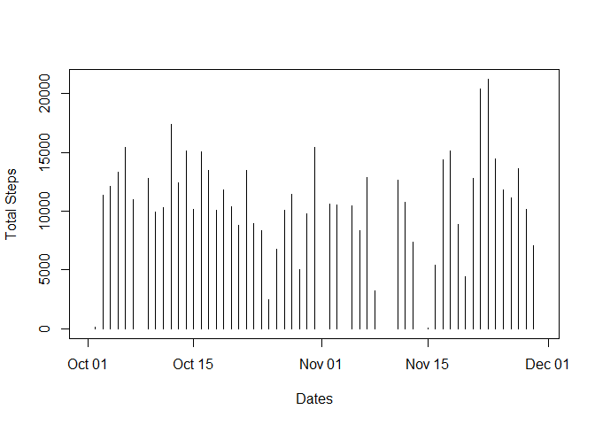

## Loading and preprocessing the data

Given data collected from an activity monitor (ie. Fitbit) at 5 minute intervals, we are conducting some exploratory analysis to get a better high-level understanding of what this data shows.  
  
  
  
The first thing we will do is unzip the data and read it into R.

```r
#Q1
#Read data into R
unzip("activity.zip")
data <- read.csv("activity.csv")
```
  

## What is mean total number of steps taken per day?
  
To start, let's plot the total number of steps taken each day

```r
#Q2
#massage data into a dataframe, summing steps by date
sumSteps <- tapply(data$steps, data$date, sum)
sumStepsDf <- data.frame(dates=names(sumSteps), totals=sumSteps)
sumStepsDf$dates <- as.Date(sumStepsDf$dates)
plot(sumStepsDf$dates, sumStepsDf$totals, type="h", xlab="Dates", ylab="Total Steps")
```

<!-- -->


The total median steaps are 10765 and the mean steps are 10766.19

```r
#Q3
median(sumStepsDf$totals, na.rm=TRUE)
```

```
## [1] 10765
```

```r
mean(sumStepsDf$totals, na.rm=TRUE)
```

```
## [1] 10766.19
```

## What is the average daily activity pattern?
We are also interested in how these averages change across different time intervals. In this case, we use the mean as our "average" definition, instead of median or mode.

```r
#Q4
avgSteps <- tapply(data$steps, data$interval, mean, na.rm=TRUE)
avgStepsDf <- data.frame(interval=names(avgSteps), averages=avgSteps)

#transforming data to numeric, as well as ordering it
avgStepsDf$interval <- as.numeric(as.character(avgStepsDf$interval))
avgStepsDf <- avgStepsDf[order(avgStepsDf$interval),]

plot(avgStepsDf$interval, avgStepsDf$averages, type="l", xlab="Interval", ylab="Average Steps")
```

<!-- -->

Which 5-minute interval, on average across all the days in the dataset, contains the maximum number of steps? The interval 835.

```r
#Q5
max(avgStepsDf)
```

```
## [1] 2355
```

```r
avgSteps[grepl(206.1698113, avgStepsDf$averages)]
```

```
##      835 
## 206.1698
```

## Imputing missing values
There are 2304 NA values in the dataset.


```r
#Q6
sum(is.na(data))
```

```
## [1] 2304
```

To fill in the NA values, we will use the average (median) value of all values within the same time interval. We will use the imputed data set for the remainder of this analysis.

```r
#Q7
imputedData <- merge(data, avgStepsDf, by.x = "interval", by.y="interval")
imputedData$date <- as.Date(imputedData$date)
imputedData$steps[is.na(imputedData$steps)] <- as.numeric(imputedData$averages)
```

```
## Warning in imputedData$steps[is.na(imputedData$steps)] <-
## as.numeric(imputedData$averages): number of items to replace is not a multiple
## of replacement length
```

```r
imputedTotal <- tapply(imputedData$steps, imputedData$date, sum)
imputedDF <- data.frame(dates=names(imputedTotal), totals=imputedTotal)
imputedDF$dates <- as.Date(imputedDF$dates)
```

A histogram showing the total number of steps taken, given the imputed data.


```r
#Q8
plot(imputedDF$dates, imputedDF$totals, type="h", xlab="Dates", ylab="Total Steps")
```

<!-- -->


The impact of imputing missing values raises the mean, while keeping the median relatively similar to the non-adjusted dataset.


```r
#Q9
mean(imputedDF$totals)
```

```
## [1] 9371.437
```

```r
median(imputedDF$totals)
```

```
## [1] 10395
```


## Are there differences in activity patterns between weekdays and weekends?
A new factor is created to indicate Weekend/Weekday.


```r
#Q10
imputedData$weekday <- ifelse(weekdays(imputedData$date) %in% c("Saturday", "Sunday"), "Weekend", "Weekday")
```


To wrap things up, we use the imputed data to compare average steps within 5-minute intervals, breaking out the data by weekend/weekday


```r
#Q11

imputedWeekend <- subset(imputedData, imputedData$weekday=="Weekend")
imputedWeekday <- subset(imputedData, imputedData$weekday=="Weekday")
imputedWeekendData <- tapply(imputedWeekend$steps, imputedWeekend$interval, median)
imputedWeekdayData <- tapply(imputedWeekday$steps, imputedWeekday$interval, median)

weekendDF <- data.frame(interval=names(imputedWeekendData), average=imputedWeekendData)
weekdayDF <- data.frame(interval=names(imputedWeekdayData), average=imputedWeekdayData)

weekendDF$interval <- as.numeric(as.character(weekendDF$interval))
weekdayDF$interval <- as.numeric(as.character(weekdayDF$interval))

weekendDF <- weekendDF[order(weekendDF$interval),]
weekdayDF <- weekdayDF[order(weekdayDF$interval),]

par(mfrow=c(2,1), mar=c(3,4,2,1))
plot(weekendDF$interval, weekendDF$average, type="l", xlab="",ylab="Average Steps", main="Weekend")
mtext("Interval", side=1, padj=3)
plot(weekdayDF$interval, weekdayDF$average, type="l", xlab="",ylab="Average Steps", main="Weekday")
mtext("Interval", side=1, padj=3)
```

<!-- -->
